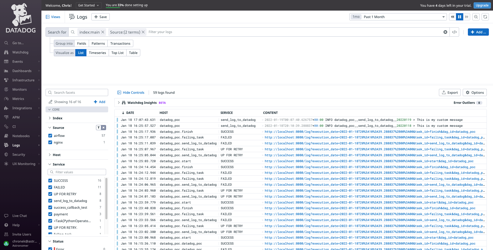

# CSE Tutorial - Datadog
Proof of concept to integrate the Datadog API with callbacks and Airflow tasks to update Datadog objects (i.e. Logs, Metrics, etc.)
___
#Prerequisites
- [Astro CLI](https://docs.astronomer.io/enterprise/cli-quickstart/)
- [GIT](https://git-scm.com/book/en/v2/Getting-Started-Installing-Git)
- A Datadog account
___
#Steps to Use:
###Run the following in your terminal:
1. `git clone git@github.com:astronomer/cs-tutorial-datadog.git`
2. `cd cs-tutorial-datadog`
3. `astro dev start`
###Add the `datadog_default` connection to your sandbox:
*Note that the `airflow_settings.yaml` file has the `datadog_default` connection predefined and it should generate automatically. However, if it doesn't automatically populate when you use the `astro d start` command, you can either add it manually using the steps below, or just try restarting your sandbox using `astro dev stop && astro dev start`. Keep in mind that you'll need to replace the `<INSERT-API-KEY>` and `<INSERT-APP-KEY>` of the connection's extra field with your actual API key and APP key.*

1. Go to your sandbox http://localhost:8080/home
2. Navigate to connections (i.e. Admin >> Connections)
3. Add a new connection with the following parameters:
    - Connection Id: `datadog_default`
    - Connection Type: `HTTP`
    - Host: `https://http-intake.logs.datadoghq.com`
    - Extra: `{"api_key": "<INSERT-API-KEY>", "app_key": "<INSERT-APP-KEY>"}`
###Unpause and run the `datadog_poc` DAG:
1. Go to your DAGs by navigating to http://localhost:8080/home
2. Unpause the DAG by toggling the switch to the left of the `datadog_poc` DAG
3. Click the trigger icon under the *Actions* section of the `datadog_poc` DAG

###Viewing the results of the DAG Run:
Check your Datadog log explorer, you should see logs begin to populate for each of the tasks in the DAG

You may have noticed that one of the tasks failed in  your DAG run, **this is by design** as it will allow you to see what task failures would look like in the Datadog Logs UI

If you look at the code for the `datadoc_poc` DAG, you'll notice that in the `default_args` for the DAG, we've set the following parameters:
- `on_success_callback`
- `on_failure_callback`
- `on_retry_callback`

These callback functions are defined in the `/include/datadog.py` directory and can be customized to suite your organization's needs.

There is also another task in our DAG that is called `send_log_to_datadog` this also uses the custom library located at `/include/datadog.py` to pass sepecified parameters to the Datadog log. In this POC, we are using [Jinja Template Variables](https://airflow.apache.org/docs/apache-airflow/stable/templates-ref.html). But these can also be customized to suite your organization's needs.
